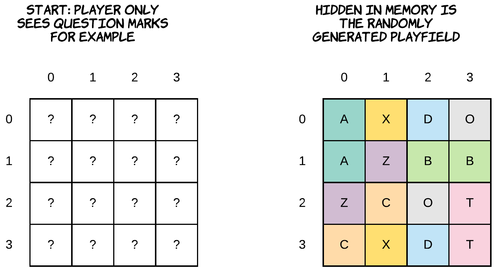
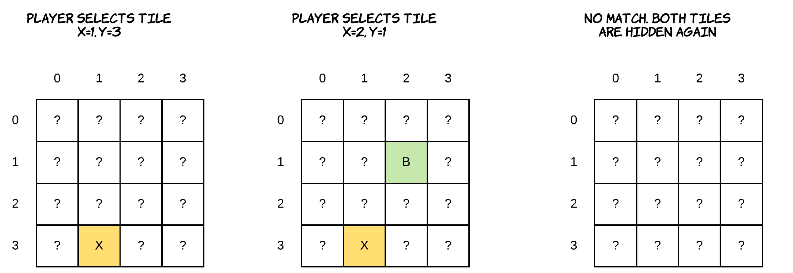
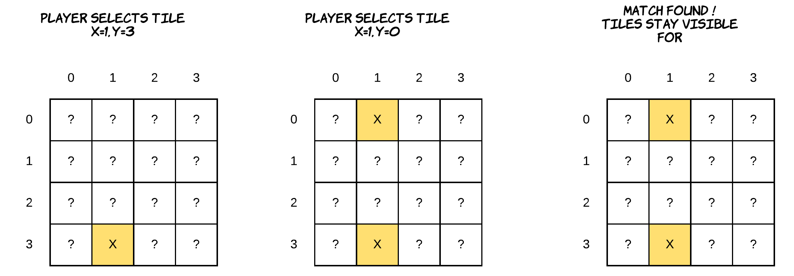

# Where's My ASCII

Where's My ASCII is a game meant to train the memory capacity of your brain.

It consist of a randomly generated playfield of tiles, where each tile contains a hidden letter.

The idea is that the player can turn over two tiles searching for matches.

Once a match between 2 tiles is found, the tiles should stay visible and cannot be selected anymore.

The game should also introduce a difficulty that influences:

* the characters used (upper case and lower letters, digits, ...)
* the size of the playfield
* the number of tiles that need to match (2, 3, ...)

## Challenge

**Minimal requirements:**

* Makefile, README, gitignore, ...
* Git history: This game needs a decent number of commits. If the progress can not be seen in the history of git I may assume you just copy pasted some stuff from internet
* Sources of things you use from the internet
* Generate playfield randomly
* User should be able to type the coordinates of the tile he/she wishes to turn
* Difficulty level: easy, medium, insane, ...
  * Next are some ideas, feel free to determine these difficulty levels yourself
  * Easy can for example be a playfield of 4 by 4, only containing upper case letters - requiring matching of 2 tiles
  * Medium can for example be a playfield of 6 by 6, containing upper case letters and digits - requiring matching of 2 tiles
  * Insane can for example be a playfield of 8 by 8, containing upper and lower case letters and numbers - requiring matching of 3 tiles
* OOP, everything should be object oriented. This project needs at least classes such as `Game`, `Playfield`, `Tile`, `Player`, `PlayfieldGenerator`, ...
* User friendly:
  * Welcome the player, explain the game, show help, ...
  * Show a decent playfield interface
  * Inform the user what characters he/she needs to be looking for

**For extra points:**

* Scoreboard: if you did your job in WordBlaster than this should be almost no work
* Easter eggs and cheats
* Create a more visual interface, this is even possible in the terminal
* Powerups or something something similar. For example if you find two matches within 5 seconds of each other 5 random tiles are shortly visible
* ...

The idea is that you can be really creative in your implementation and your interface. Use your creativity wisely to make this a fun and nice looking game.

## SCREENCAST

**Screencast**:

* Make sure to provide a small screencast (couple of minutes) to clarify the following topics:
  * Show the compilation proces and how it is compiled
  * Show the application and explain how it works
  * Conclusion: What went well, what was hard, special libraries you used, ...
  * No code-scrolling ! If you wish, you can always show an overview of your classes using a UML-diagram.

Use Kaltura or OBS Studio to make your screencast. Upload the video to YouTube and place a link in this README.

## DEADLINE

The deadline for this challenge is: **Monday the 8th of June (23:59)**

## WARNING

This challenge is a solo-challenge. While you can help someone by giving some pointers or explaining something, the repo's should not contain copy-pasted code from another student. This challenge is a big part of you grade for OOP3, so be sure to take this challenge serious.
