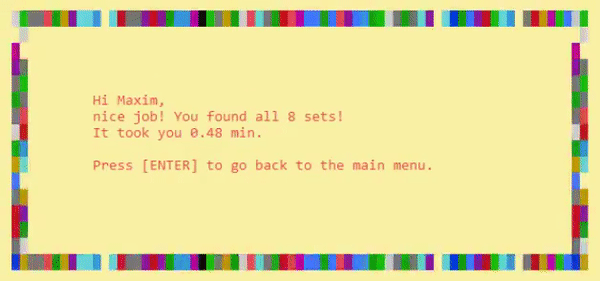
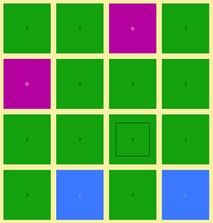
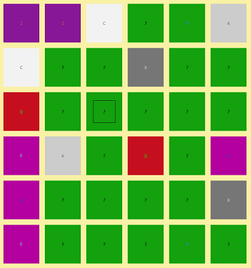
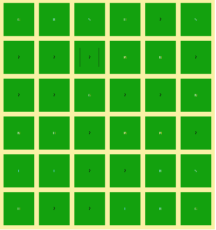
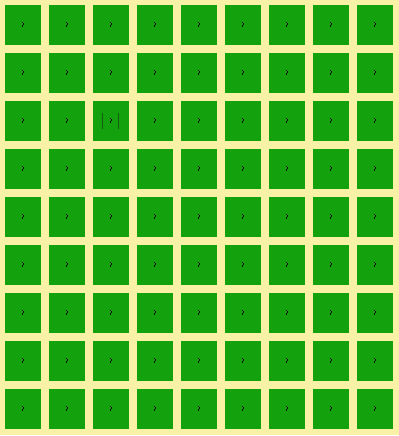
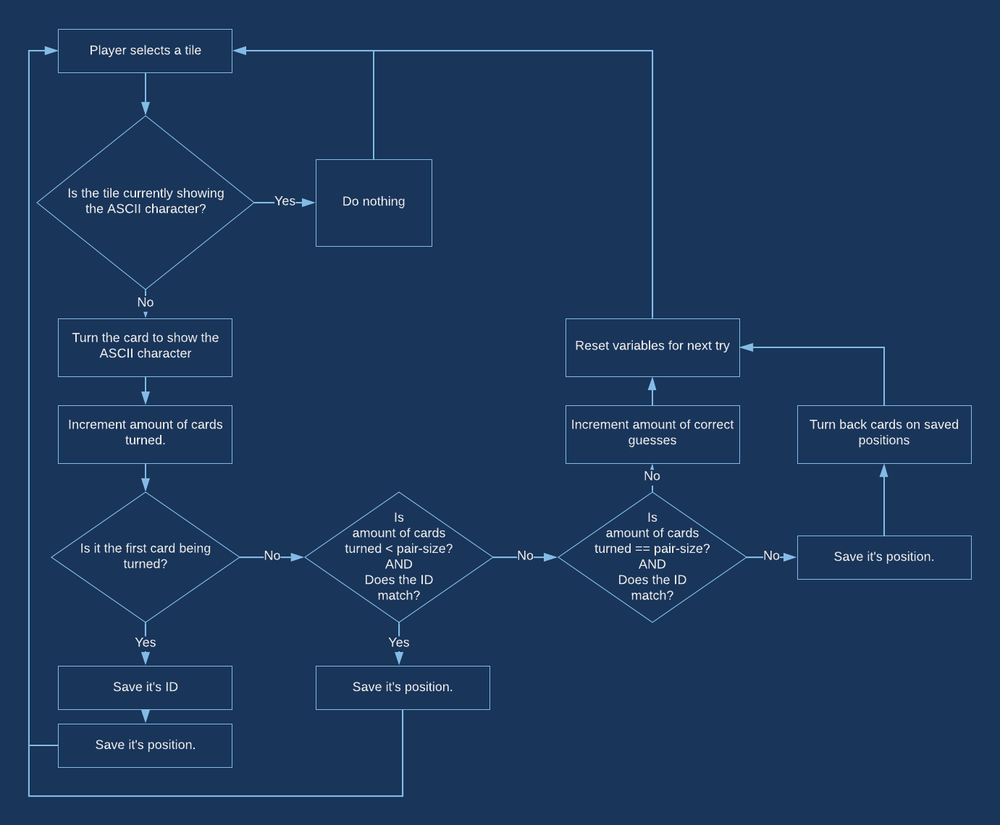

# Where's My ASCII

ASCII ADVENTURE is a game about finding your luck, about persistance. It's about letters on tiles, and finding all the sets to complete the game. Be sure to take a look at the about page in the game. There are a few cheats/power-ups/easter-eggs you can try out!

When you start playing, don't be fooled by the first level, you might come to think it's an easy game, easily mastered. But think again as you work your way up, things get hard, fast.

If you did a good job you will be greeted with this animation:


## Gameplay

As soon as you see the playfield the clock starts ticking.
You have to find all the tile sets on the playfield to finish the game, this starts out easy with a set containing two tiles and nicely color-coded sets with each a unique character.
But starting at level 3 you have to find 3 identical tiles to get the set.
However, if you enter the hardcore dungeon which is level 4... all bets are off. Make sure not to go all Leeroy Jenkins, it will not work!
3 tiles still make a set, but the colors are gone... and multiple sets can have the same character... it's madness!!

### Controls

Use the arrow keys to move around and return or space to flip a tile.

### Difficulty levels

|  | Grid size | Tiles in set | Unique color for each set | Unique ASCII char for each set |
|:-:|:-:|:-:|:-:|:-:|
| 1 | 4 x 4 | 2 | ✅ | ✅ |
| 2 | 6 x 6 | 2 | ✅ | ✅ |
| 3 | 6 x 6 | 3 | ❌ | ✅ |
| 4 | 9 x 9 | 3 | ❌ | ❌ |

#### Level 1



#### Level 2



#### Level 3



#### Level 4



## Game logic



## How to install

To be able to run this game you will need the following:

- an MS Windows machine with the following minimum system requirements
  - Intel Core i9-7900X
  - Nvidia GeForce RTX 2060 Super (2060S)
  - 64GB RAM
  - 1TB SSD
  - ...
  - just kidding, on board graphics and the minimum specs to run Windows will do fine
- the 'g++' compiler

Then clone the project to an directory of you're liking:

```shell
git clone git@github.com:vives-oop3-2020/wheres-my-ascii-maximva.git
cd wheres-my-ascii-maximva
make
```

If everything went well then you should find the `ascii-adventure` executable in the project directory.
Hit it, and be ready to waste some time!

## Screencast

ToDo
